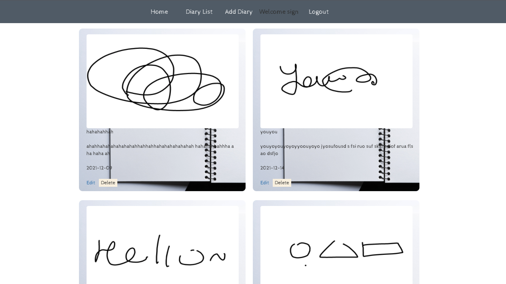
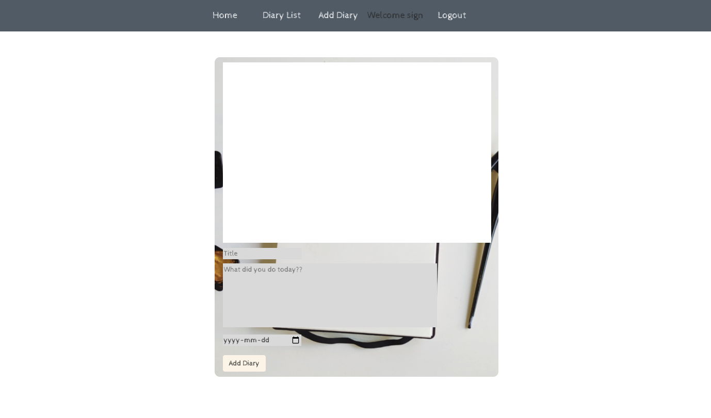
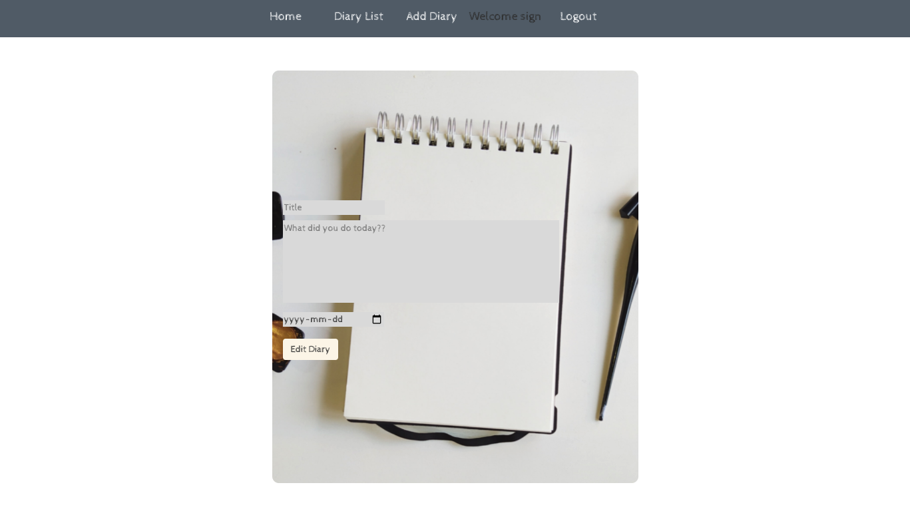
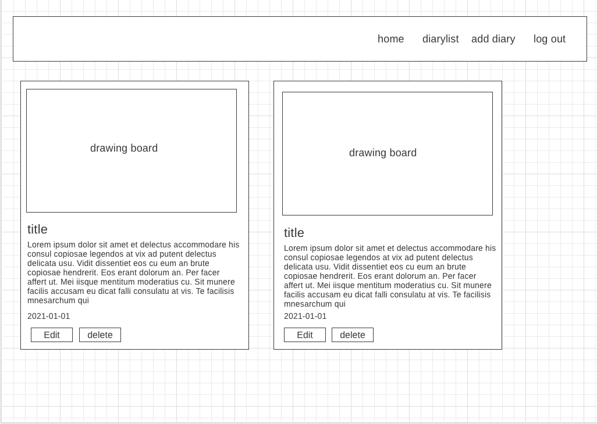
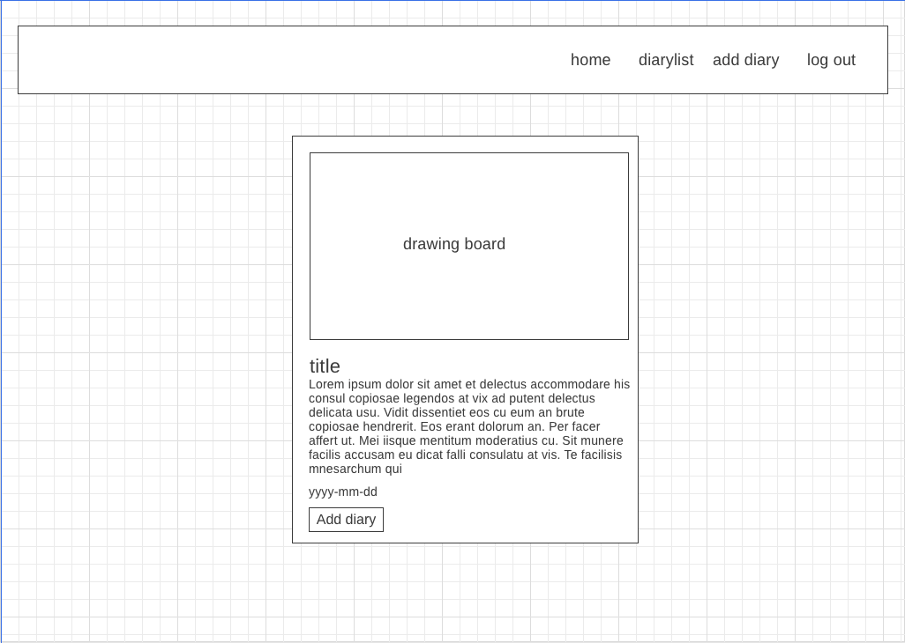
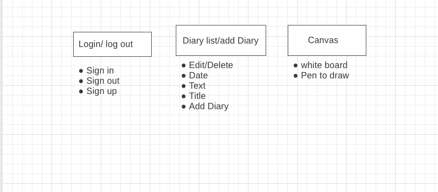

# Day By Diary

Build your own private drawing diary. You can write a day diary with title, text, date inside it and edit the diary for changing informations. You can also draw you imagination on canvas! 

## Screenshot(s):

## Technologies Used:

React, Express, Node, Mongoose, Bootstrap, HTML, CSS, Heroku

## Getting Started:

## Next Steps:

- Upload images/assets to AWS S3
- Add drawing tools
- Add emoji or sticker 

## Heroku:

https://daybydiary.herokuapp.com/